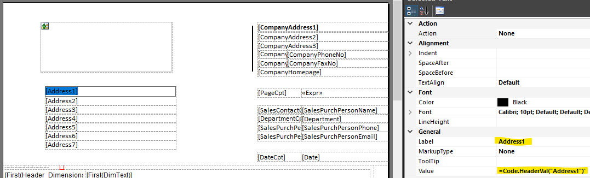

# Dynamics NAV/BC RDLC Custom Code - Improving SetData & GetData

__Table of Contents__
* __Getting Started__
  * [RDLC: #1 Add new functions the custom code section](#1A)
  * [C/AL or AL: Add methods to create a key value list](#1B)
  * [C/AL or AL: Add key value list text to the dataset](#1C)  
  * [RDLC: #2 Add a hidden control in the body section to set the data](#1D)
  * [RDLC: #3 Address data by name](#1E)  
* __SetData & GetData - the NAV way__
  * [Concept](#2A)
  * [global Variables](#2B)
  * [GetData](#2C)
  * [SetData](#2D)
* __Improving SetData & GetData__
  * [Concept](#3A)
  * [global Variables](#3B)
  * [GetData ->HeaderVal(Key) & FooterVal(Key)](#3C)
  * [SetData ->SetHeaderDataAsKeyValueList & SetFooterDataAsKeyValueList](#3D)


------------------------------------------------
# Getting Started
##  RDLC: Add new methods to the custom code section <a id="1A"/>
*open the report layout, go to the custom code section and copy/paste the code below:*
```vbnet
' Source: https://github.com/AndreasRascher/RDLCReport_CustomCode
' =================
' Global variables
' =================
Shared HeaderData As Microsoft.VisualBasic.Collection
Shared FooterData As Microsoft.VisualBasic.Collection

' ==========================
' Get Header or Footer Value 
' ==========================

' Key = position number or name
Public Function HeaderVal(Key as Object)
  Return GetValue(HeaderData,Key)
End Function

Public Function FooterVal(Key as Object)
  Return GetValue(FooterData,Key)
End Function

Public Function GetValue(ByRef Data as Object,Key as Object)
  'if Key As Number
  If IsNumeric(Key) then
    Dim i as Long
    Integer.TryParse(Key,i)
    if (i=0) then
    return "Index starts at 1"
    end if
    if (Data.Count = 0) OR (i = 0) OR (i >Data.Count) then
      Return "Invalid Index: '"+CStr(i)+"'! Collection Count = "+ CStr(Data.Count)
    end if  
    Return Data.Item(i)
  end if
 
  'if Key As String
  Key = CStr(Key).ToUpper() ' Key is Case Insensitive
  Select Case True
    Case IsNothing(Data)
      Return "CollectionEmpty"
    Case IsNothing(Key)
      Return "KeyEmpty"
    Case (not Data.Contains(Key))
      Return "Key not found: '"+CStr(Key)+"'!"
    Case Data.Contains(Key)
      Return Data.Item(Key)
    Case else
      Return "Something else failed"
  End Select 
 
End Function

' ===========================================
' Set Header and Footer values from the body 
' ===========================================

Public Function SetHeaderDataAsKeyValueList(NewData as Object)
  SetDataAsKeyValueList(HeaderData,NewData)
  Return True 'Set Control to Hidden=true
End Function
 
Public Function SetFooterDataAsKeyValueList(NewData as Object)
  FooterData = New Microsoft.VisualBasic.Collection 
  SetDataAsKeyValueList(FooterData,NewData)
  Return True 'Set Control to Hidden=true
End Function
 
Public Function SetDataAsKeyValueList(ByRef SharedData as Object,NewData as Object)
  Dim i as integer
  Dim words As String() = Split(CStr(NewData),Chr(177))
  Dim Key As String
  Dim Value As String
  For i = 1 To UBound(words)   
    if ((i mod 2) = 0) then
      Key   = Cstr(Choose(i-1, Split(Cstr(NewData),Chr(177))))     
      Value = Cstr(Choose(i, Split(Cstr(NewData),Chr(177))))
      AddKeyValue(SharedData,Key,Value)
    end if
    ' If last item in list only has a key
    if (i = UBound(words)) and ((i mod 2) = 1) then
      Key   = Cstr(Choose(i, Split(Cstr(NewData),Chr(177))))     
      Value = ""
      AddKeyValue(SharedData,Key,Value)
    end if
  Next 
End Function

Public Function AddValue(ByRef Data as Object,Value as Object)
  if IsNothing(Data) then
     Data = New Microsoft.VisualBasic.Collection
  End if
  Data.Add(Value,Data.Count +1)
  Return Data.Count  
End Function
 
Public Function AddKeyValue(ByRef Data as Object, Key as Object,Value as Object)
  if IsNothing(Data) then
     Data = New Microsoft.VisualBasic.Collection
  End if
 
  Dim RealKey as String
  if (CStr(Key) <> "") Then
    RealKey = CStr(Key).ToUpper()
  else
    RealKey = CStr(Data.Count +1)
  End if
  ' Replace value if it already exists
  if Data.Contains(RealKey) then
     Data.Remove(RealKey)
  End if
 
  Data.Add(Value,RealKey)   
 
  Return Data.Count
End Function
```
##  C/AL or AL: Add methods to create a key value list <a id="1B"/>
```pascal
local procedure AddKeyValue(VAR KeyValueListAsText: Text; _Key: Text; _Value: Text)
var
	Chr177: Text[1];
	NewPair: Text;
begin
	Chr177[1] := 177;
	NewPair := _Key + Chr177 + _Value + Chr177;
	KeyValueListAsText += NewPair;
end;

local procedure GetHeaderFields(SalesHeader : Record "Sales Header"; Addr : Array[8] of Text) KeyValueList : Text
begin
        AddKeyValue(KeyValueList, 'Address1', Addr[1]);
        AddKeyValue(KeyValueList, 'Address2', Addr[2]);
        AddKeyValue(KeyValueList, 'Address3', Addr[3]);
        AddKeyValue(KeyValueList, 'Address4', Addr[4]);
        AddKeyValue(KeyValueList, 'Address5', Addr[5]);
        AddKeyValue(KeyValueList, 'Address6', Addr[6]);
        AddKeyValue(KeyValueList, 'Address7', Addr[7]);
        AddKeyValue(KeyValueList, 'Address8', Addr[8]);
        AddKeyValue(KeyValueList, 'CompanyAddress1', CompanyAddr[1]);
        AddKeyValue(KeyValueList, 'CompanyAddress2', CompanyAddr[2]);
        AddKeyValue(KeyValueList, 'CompanyAddress3', CompanyAddr[3]);
end;
```
##  C/AL or AL: Add key value list text to the dataset <a id="1C"/>
Example in AL:
```
    dataset
    {
        dataitem("Purchase Header"; "Purchase Header")
        {
	    [...]
            column(HeaderFieldsList; GetHeaderFields("Purchase Header"))
            { }
            column(FooterFieldsList; GetFooterFields("Purchase Header"))
            { }
	    [...]
```
##  RDLC: Add a hidden control in the body section to set the data <a id="1D"/>
* open the report.rdl file, search for "\<ReportItems>" and paste the following text below
* move the tablix into your list tablix if necessary
```xml
<Tablix Name="SetHeaderTable">
  <TablixBody>
	<TablixColumns>
	  <TablixColumn>
		<Width>0.3cm</Width>
	  </TablixColumn>
	</TablixColumns>
	<TablixRows>
	  <TablixRow>
		<Height>0.3cm</Height>
		<TablixCells>
		  <TablixCell>
			<CellContents>
			  <Textbox Name="SetHeaderTableCell">
				<CanGrow>true</CanGrow>
				<KeepTogether>true</KeepTogether>
				<Paragraphs>
				  <Paragraph><TextRuns><TextRun><Value /><Style /></TextRun></TextRuns><Style /></Paragraph>
				</Paragraphs>
				<Visibility>
				  <Hidden>=Code.SetHeaderDataAsKeyValueList(Fields!HeaderFieldsList.Value)</Hidden>
				</Visibility>
				<Style>
				  <Border>
					<Style>None</Style>
				  </Border>
				</Style>
			  </Textbox>
			  <rd:Selected>true</rd:Selected>
			</CellContents>
		  </TablixCell>
		</TablixCells>
	  </TablixRow>
	</TablixRows>
  </TablixBody>
  <TablixColumnHierarchy><TablixMembers><TablixMember /></TablixMembers></TablixColumnHierarchy>
  <TablixRowHierarchy><TablixMembers><TablixMember /></TablixMembers></TablixRowHierarchy>
  <Filters><Filter><FilterExpression>=Fields!HeaderFieldsList.Value</FilterExpression>
	  <Operator>GreaterThan</Operator>
	  <FilterValues><FilterValue>""</FilterValue> </FilterValues></Filter> </Filters>
  <Left>1.13167cm</Left><Height>0.3cm</Height><Width>0.3cm</Width><ZIndex>1</ZIndex>
  <Style><Border><Color>Red</Color><Style>Solid</Style></Border></Style>
</Tablix>
```

##  RDLC: Get data by name <a id="1E"/>

------------------------------------------------

## SetData & GetData - Concept <a id="2A"/>
The report layout is rendered in different steps. Header and footer are rendered after the body. So if we want to align header or footer contents with the current content in the page body we need to use tranfer data from the body via custom code functions.

* `Code.SetData` - saves a list of values as text in a global variable. The values are seperated by the character __&#177;__ . The code representation of that character is `Chr(177)`
* `Code.GetData` - returns a value from one of the 3 lists at the requested position number

## global Variables <a id="2B"/>
```vbnet
Shared Data1 as Object
Shared Data2 as Object
Shared Data3 as Object
```
## GetData <a id="2B"/>
```vbnet
Public Function GetData(Num as Integer, Group as integer) as Object
  ' Num    - position of the string you want to have 
  ' Group  - select which of the 3 globals you want to use as source 
  ' Object - return value  

  if Group = 1 then
  Return Cstr(Choose(Num, Split(Cstr(Data1),Chr(177))))
  End If

  if Group = 2 then
  Return Cstr(Choose(Num, Split(Cstr(Data2),Chr(177))))
  End If

  if Group = 3 then
  Return Cstr(Choose(Num, Split(Cstr(Data3),Chr(177))))
  End If
End Function
```
## SetData <a id="2C"/>
```vbnet     
Public Function SetData(NewData as Object,Group as integer)
  ' NewData     - string with char177 as seperator char 
  ' Group       - select which of the 3 globals you want to use as source 
  ' Return True - Required to hide the blind table. The method is called within the hidden property of the tablix cell. The propery is processed before rendering other the values 
  If Group = 1 and NewData <> "" Then
      Data1 = NewData
  End If

  If Group = 2 and NewData <> "" Then
      Data2 = NewData
  End If

  If Group = 3 and NewData <> "" Then
      Data3 = NewData
  End If
  Return True
End Function
```
## Improving SetData & GetData - The Concept <a id="3A"/>
The NAV approach has some drawbacks we would like to avoid
* after adding new fields to the list, the counting starts. You need to know the position of the item in a list to get the correct value.
* looking at `=Code.GetData(3,1)` doesn't indicate which value we want to get
* Having 2 arguments instead of 1 in the GetData function only adds to the complexity
* the list of values is maintained in RDLC instead of C/AL or AL which takes a lot of time and is hard to compare between versions

__Target #1__ Providing the possibility of named indexes to avoid counting and provide better readability
- Approach: Using the Microsoft.VisualBasic.Collection() Object as new global variable. The Class is already available without the need for enabling of external assemblies

__Target #2__ GetData should only need 1 argument
- Approach: Seperating the get function inte one for footer data and one for header data
- Approach: Providing one global to pass values to the header and another global to pass values to the footer

__Target #3__ Make it easier to maintain the value list 
- Approach: By creating a procedure (C/AL or AL) to create a list of values, adding and modifying our Field-List becomes a lot easier

## GetData ->HeaderVal(Key) & FooterVal(Key) <a id="#3C"/>

As shown in the example above getting the data into the header works by calling
```vbnet
=Code.HeaderVal("YourIdentifier")'
```
or into the footer
```vbnet
=Code.FooterVal("YourIdentifier")'
```
**!Please end your Expressions with an apostrophe or else you will loose the arguments when copy & pasting textboxes from one instance of SQL Report Builder to another**
